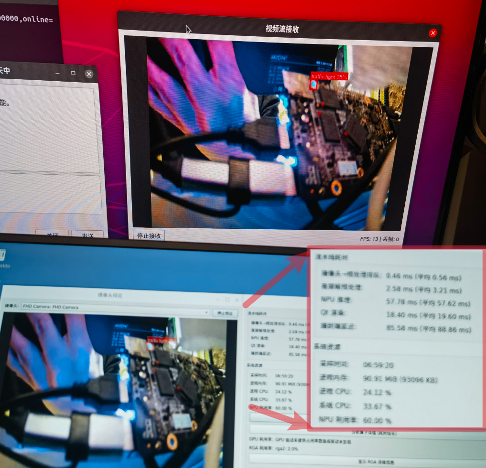

<div align="center">

**简体中文** | [English](README.en.md)



# KyLink

RK3566 + Ubuntu Kylin 的边缘智能通信与视频流系统（FeiQ / NPU / GStreamer / LED Driver）

[](https://wiki.t-firefly.com/ROC-RK3566-PC/)
[](https://ubuntukylin.com/)
[](https://github.com/rockchip-linux)
[](https://gstreamer.freedesktop.org/)
[](./cpp-chatroom/feiqlib)
[](./cpp-chatroom/CMakeLists.txt)
[](LICENSE)

---

</div>

## 项目简介

KyLink 是一个在 RK3566 + Ubuntu Kylin 平台上落地的嵌入式系统工程项目，聚焦“局域网通信 + 视频流传输 + NPU 推理加速 + 板级驱动”一体化能力验证。

项目主线为 `cpp-chatroom`：在 FeiQ 协议通信基础上，扩展跨平台构建、视频流推送/接收、NPU 检测链路与性能分析能力；同时保留 `my_kylin_led_driver` 作为 BSP/内核驱动实践资产。

## 主要特性

- 局域网即时通信：基于 FeiQ/IPMsg 协议（UDP 2425 + TCP 文件传输）
- 跨平台构建：支持 Ubuntu Kylin 桌面版与 RK3566 交叉编译
- 视频流传输：UDP 分包重组（默认 2426 端口），面向低延迟传输
- NPU 推理链路：集成 RKNN + RGA + MPP，支持视频流实时检测
- 系统调试能力：内置 NPU/RGA/MPP 运行态探针脚本
- 板级驱动实践：包含 LED 字符设备驱动与使用说明

## 项目结构

```text
KyLink/
├── cpp-chatroom/               # 主应用：Qt UI + FeiQ + 视频流 + NPU
│   ├── src/                    # 业务实现
│   ├── include/                # 头文件
│   ├── feiqlib/                # FeiQ 协议栈
│   ├── env/                    # RK3566 交叉编译环境脚本
│   ├── docs/                   # 关键变更留档
│   └── GNUmakefile             # make desktop / make rk3566
├── my_kylin_led_driver/        # LED 驱动与内核模块产物
├── Reference/                  # 参考实现与协议资料
├── npu_info_explorer.sh        # NPU 信息探针
├── rga_info_explorer.sh        # RGA 信息探针
├── mpp_info_explorer.sh        # MPP 信息探针
└── LICENSE                     # GPLv3
```

## 性能快照（含实验条件）

### 模型与运行配置

| 项目 | 配置 |
|---|---|
| 默认模型文件 | 运行时：`cpp-chatroom/npu_assets/yolov5s_relu.rknn`；仓库资产：`cpp-chatroom/rknpu_resources/rk3566_model/yolov5s_relu.rknn` |
| 模型输入张量 | `(1, 3, 640, 640)`（见 `performance_snapshot_20251227_060820.log`） |
| 推理数据类型 | 输入 `UINT8`，主干算子 `INT8`（算子级日志可见） |
| 量化方式 | RKNN 量化张量（`scale + zp` 仿射反量化，见 `postprocess.cpp`） |
| 后处理阈值 | `BOX_THRESH=0.25`，`NMS_THRESH=0.45` |
| 相机输入 | `image/jpeg, 640x480`（GStreamer caps） |
| 预处理路径 | `NV12 -> RGA letterbox -> 640x640 RGB -> RKNN` |
| NPU 驱动版本 | `RKNPU driver v0.9.3`（性能快照日志） |

### 性能结果（2025-12-27 两组快照）

| 指标 | 观测值 | 数据来源 |
|---|---|---|
| 端到端延迟（平均） | `69.6 ms` / `80.5 ms` | `performance_snapshot_20251227_060820.log`、`...060846.log` |
| NPU 阶段耗时（5帧窗口） | `52.6–58.0 ms` | 两份快照的 `NPU(μs)` 列 |
| 预处理阶段耗时（5帧窗口） | `1.8–4.1 ms` | 两份快照的 `预处理(μs)` 列 |
| 视频流接收帧率 | `~15 FPS` | `cpp-chatroom/docs/留档-20251225-跨平台视频流协议实现.md` |
| 视频流丢帧 | `0–3 帧` | 同上 |
| 检测吞吐（项目档案） | `11–19 FPS` | 上级项目档案与阶段复盘记录 |
| C++ 重构后内存占用 | `81.56 MB` | 上级项目档案 |

> 注：快照结果受模型版本、输入分辨率、量化参数、RGA/MPP负载和系统温度等因素影响。

## 快速开始

### 1) 构建桌面版（Ubuntu/Linux x64）

```bash
cd cpp-chatroom
make desktop
```

### 2) 交叉编译 RK3566 版本

```bash
cd cpp-chatroom
source env/setup-rk3566.sh
make rk3566
```

### 3) 查看构建帮助

```bash
cd cpp-chatroom
make help
```

## 运行态探针

在 `KyLink` 根目录可直接执行：

```bash
bash npu_info_explorer.sh
bash rga_info_explorer.sh
bash mpp_info_explorer.sh
```

## 致谢

- FeiQ/IPMsg Linux 实现参考：[`uenigmas/linux_feiq`](https://github.com/uenigmas/linux_feiq)
- 现仓库中相关历史参考代码位置：`Reference/linux_feiq-master`

## 许可证

本项目采用 [GNU GPL v3](LICENSE)。
